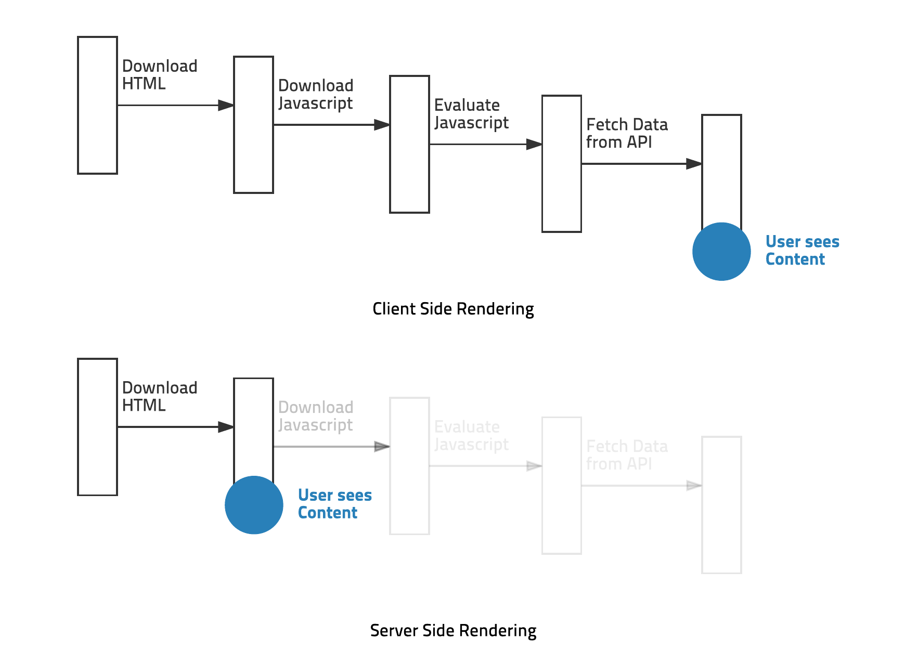
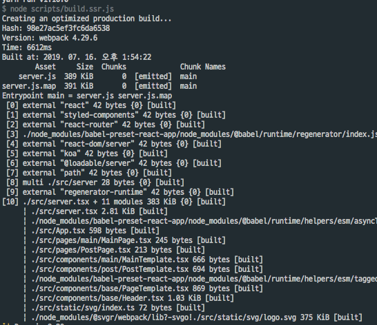
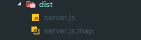
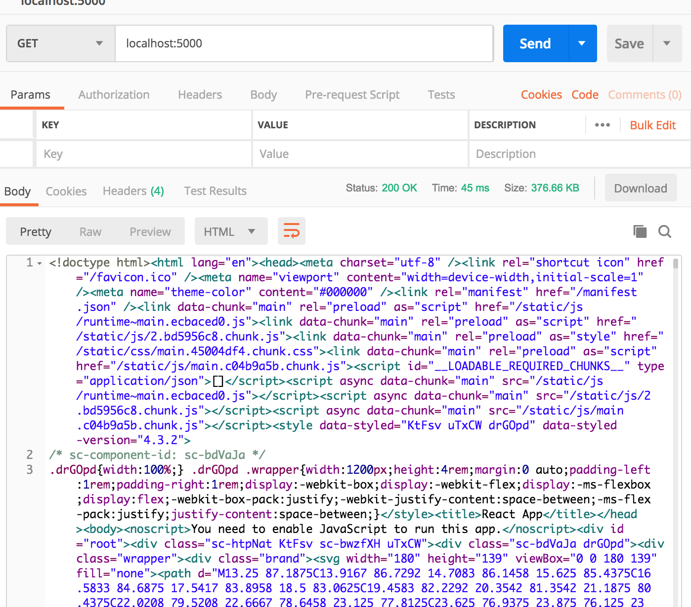

# React 서버사이드 렌더링


##  SSR(Server Side Rendering)?

말 그대로 서버사이드 렌더링은 서버로 부터 렌더링을 하겠다.<br>
서버연산을 통해서 렌더링하고 페이지를 응답 하는 방법이 SSR <br>
SSR의 경우에는 View를 서버에서 렌더링해 가져오기 때문에, 첫 로딩이 매우 짧다. <br>
but 물론 SSR을 사용하면 클라이언트에서 JS 파일을 모두 다운로드하고 적용하기 <br>
전까지는 각각의 기능이 동작하지 않겠지만<br>

`사용자의 입장에서는 매우 빠른 속도로 로딩이 되었다고 느낀다.!`


## SPA , CSR 렌더링 방식

한번만 리소스 로딩 하고 필요할 때마다만 서버와 통신해서 사용<br>
요청하면 한페이만 불로서 이동시에 기존페이지를 수정해서 렌더링해주는 방식


### SSR 장점
SEO(Search Engine Optimization, 검색 엔진 최적화)

React or Vue 같은 자바스크립트 라이브러리는 엔진(자바스크립트 엔진) 동작하지 않으면 정보가 X
따라서 HTML에 데이터를 담고 렌더링이 필요 할때 사용 


### SSR 단점
- 화면 이동시 화면 깜빡임(UX)
- 프로젝트에 복잡해진다.
    - 먼저 서버 코드에 있어서도 JSX를 사용할 수 있도록 빌드나 변환하는 과정이 필요
- 성능 악화 
    - 서버 렌더링에 따른 부하(성능)

## 서버사이드 렌더링 READY!!

- 환경
    - typescript React
    - @loadable/component
    - react-router
    - react-dom/server

### Server.tsx 생성
```js
import React from 'react';
import ReactDOMServer from 'react-dom/server';
import Koa, { Middleware } from 'koa';
import { StaticRouter } from 'react-router';
import { ChunkExtractor } from '@loadable/server';
import { ServerStyleSheet } from 'styled-components';
import path from 'path';
import App from './App';

const app = new Koa();
const clientStats = path.resolve('./build/loadable-stats.json');
const ssr: Middleware = async ctx => {
    const context =  {};
    const extractor = new ChunkExtractor({ statsFile: clientStats });

    const jsx = extractor.collectChunks( <StaticRouter location={ctx.url} context={context}>
        <App />
    </StaticRouter>)
    const sheet = new ServerStyleSheet();
    const rendered = ReactDOMServer.renderToString(sheet.collectStyles(jsx));
    const scStyles = sheet.getStyleTags();
    const collected = {
         script: extractor.getScriptTags(),
         link  : extractor.getLinkTags(),
         style :extractor.getScriptTags() +  scStyles,
    };
    const page = createPage(rendered, collected);

    ctx.body = page;
};
app.use(ssr);
app.listen(5000, () => {
    console.log('SSR server listening to http://localhost:5000')
})
```

### webpack 설정 
1. config/paths.js 설정
```js
// config after eject: we're in ./config/
module.exports = {
  dotenv: resolveApp('.env'),
  appPath: resolveApp('.'),
  appBuild: resolveApp('build'),
  appPublic: resolveApp('public'),
  appHtml: resolveApp('public/index.html'),
  appIndexJs: resolveModule(resolveApp, 'src/index'),
  appPackageJson: resolveApp('package.json'),
  appSrc: resolveApp('src'),
  ..
  ..
  ..
  servedPath: getServedPath(resolveApp('package.json')),  // 기존에 있던 내용들...

  //추가한다.!!!
  ssrIndexJs: resolveApp('src/server'),
  ssrBuild: resolveApp('dist'),
};
```

2. (config/webpack.config.server.js)
```js
const fs = require('fs');
const path = require('path');
const webpack = require('webpack');
const resolve = require('resolve');
const PnpWebpackPlugin = require('pnp-webpack-plugin');
const ModuleScopePlugin = require('react-dev-utils/ModuleScopePlugin');
const getCSSModuleLocalIdent = require('react-dev-utils/getCSSModuleLocalIdent');
const paths = require('./paths');
const getClientEnvironment = require('./env');
const ModuleNotFoundPlugin = require('react-dev-utils/ModuleNotFoundPlugin');
const ForkTsCheckerWebpackPlugin = require('fork-ts-checker-webpack-plugin');
const typescriptFormatter = require('react-dev-utils/typescriptFormatter');
const nodeExternals = require('webpack-node-externals');

...불필요 삭제

// This is the production and development configuration.
// It is focused on developer experience, fast rebuilds, and a minimal bundle.
module.exports = function(webpackEnv) {
  const isEnvDevelopment = webpackEnv === 'development';
  const isEnvProduction = webpackEnv === 'production';
  ...생략
  // path 설정
    return {
        entry: [paths.ssrIndexJs].filter(Boolean),
        target: 'node',
        externals: [nodeExternals()],
        output: {
        // The build folder.
        path: paths.ssrABuild,
        filename: 'server.js',
        chunkFilename: isEnvProduction
            ? 'static/js/[name].[chunkhash:8].chunk.js'
            : isEnvDevelopment && 'static/js/[name].chunk.js',
        },
  

  };
};

```

3.scripts/build.ssr 파일 설정
```js
// Do this as the first thing so that any code reading it knows the right env.
process.env.BABEL_ENV = 'production';
process.env.NODE_ENV = 'production';

// Makes the script crash on unhandled rejections instead of silently
// ignoring them. In the future, promise rejections that are not handled will
// terminate the Node.js process with a non-zero exit code.
process.on('unhandledRejection', err => {
  throw err;
});

// Ensure environment variables are read.
require('../config/env');

const fs = require('fs-extra');
const webpack = require('webpack');
const configFactory = require('../config/webpack.config.server');
const paths = require('../config/paths');
const checkRequiredFiles = require('react-dev-utils/checkRequiredFiles');

// Warn and crash if required files are missing
if (!checkRequiredFiles([paths.appHtml, paths.appIndexJs])) {
  process.exit(1);
}

// Generate configuration
const config = configFactory('production');

// Create the production build and print the deployment instructions.
function build(previousFileSizes) {
  console.log('Creating an optimized production build...');
  fs.emptyDirSync(paths.ssrBuild);
  let compiler = webpack(config);
  return new Promise((resolve, reject) => {
    compiler.run((err, stats) => {
      console.log(stats.toString());
    });
  });
}

build();
```

### Build:SSR 
1. package.json scripts 선언
```json
  "scripts": {
    "start": "node scripts/start.js",
    "build": "node scripts/build.js",
    "build:ssr": "node scripts/build.ssr.js",
    "test": "node scripts/test.js"
  },
```
2. Build

`yarn build:ssr`

[console]



[output]



3. server 실행
`node ./dist/server.js`

서버사이드 연동 완료!!!



- next 쓰면 간단하다고 들었는데 아직 안써보았다.
- webpack module은 뭐가 들어있는지는 참고 할 필요가 있는듯 싶다 

## References
<br>

> - [velopert 블로그](https://velopert.com/3425)
> - [https://serverless.com/](https://serverless.com/)
> - [medium/아하 프론트 개발기(1) — SPA와 SSR의 장단점 그리고 Nuxt.js](https://medium.com/aha-official/%EC%95%84%ED%95%98-%ED%94%84%EB%A1%A0%ED%8A%B8-%EA%B0%9C%EB%B0%9C%EA%B8%B0-1-spa%EC%99%80-ssr%EC%9D%98-%EC%9E%A5%EB%8B%A8%EC%A0%90-%EA%B7%B8%EB%A6%AC%EA%B3%A0-nuxt-js-cafdc3ac2053)