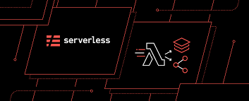
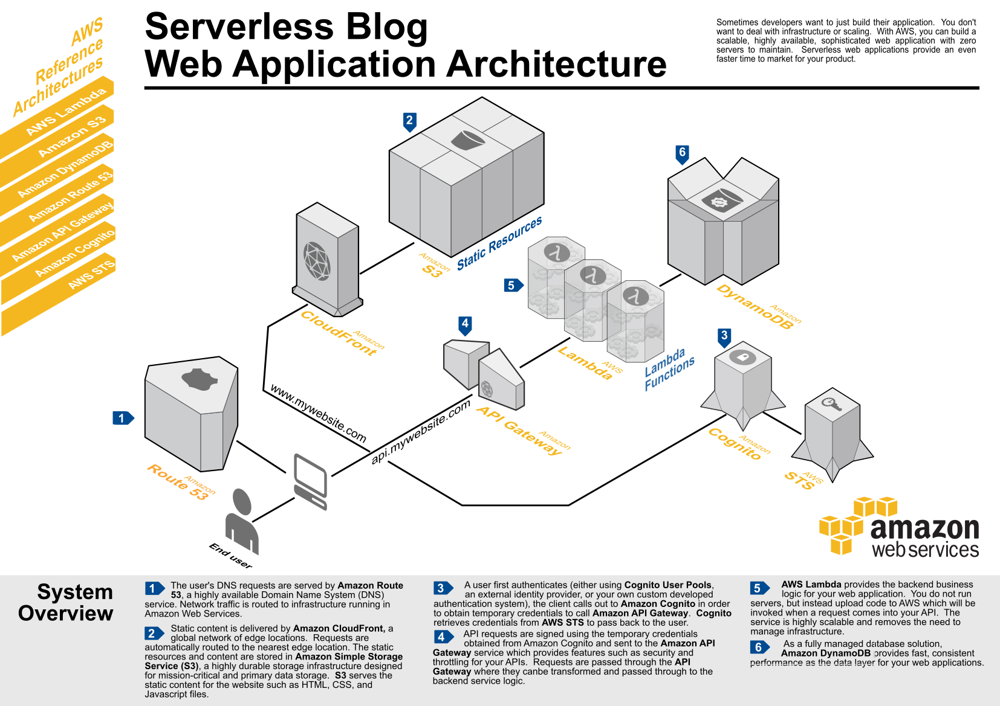
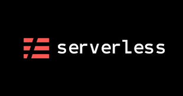
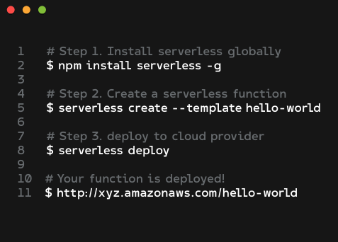
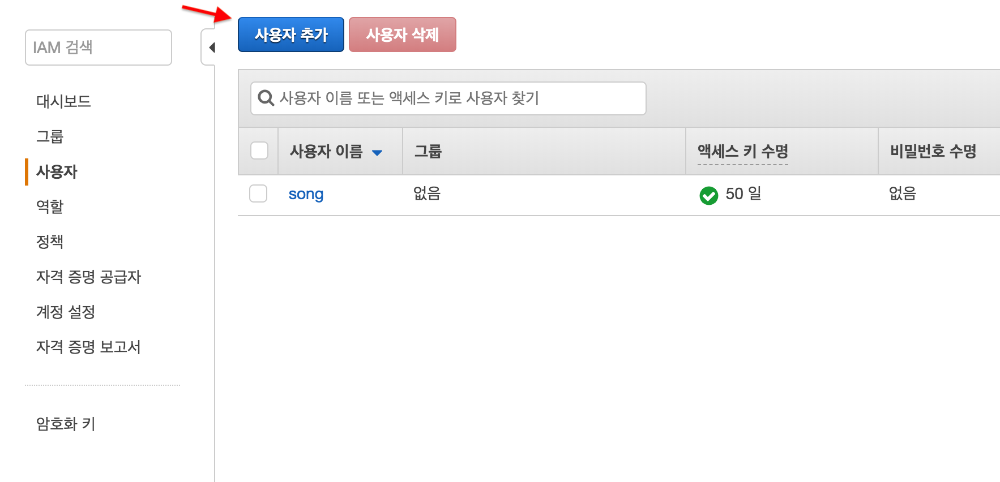

# SERVERLESS 튜토리얼

> -serverless & lambda  활용법
> - serverless란
> -  aws - lambda로 serverless 구축




## Serverless란? 

- 개요
 ```javascript
서버리스(Serverless)를 직역하자면, 
“서버가 없다” 라는 의미가 있습니다.
하지만, 사실상 서버가 없는건 아니다!!!!
단지, 특정 작업을 수행하기 위해서 
직접 컴퓨터 서버 또는 가상 컴퓨터에 설정하는것이 아닌뿐,
누가? 언제? 문제를 일으켰는지 추적할 수 있고, 
누가? 언제? 만들어낸 이슈인지도 알 수 있다.
 ```
- 종류
  - BaaS (Backend as a Service)
    - 대표 ( Firebase )
    - 개발에 있어서 다양한 기능들(DB, SNS,....등등) API 제공
    - 개발자들이 서버 개발을 하지 않아도 필요 기능을 쉽게 구현 가능
    - 비용은 사용한 만큼 사용

  - FaaS (Function as a Service)
    - 대표 AWS Lambda, Azure, GCP등등 
    - 프로젝트를 여러개의 함수로 분리해서 ( 개별 함수로 만들어서 ), 규모가 큰 컴퓨팅에 함수등록
    - 이 함수들이 실행되는 횟수 또는 시간 만큼만 지불하는 방식

## AWS Lambda

<span style="background-color: #92c7e1">** FaaS 의 대표주자는 Lambda !!!! **</span>
### 다음은 Aws 서버리스 지원 영역

| 항목 | 설명 |
|:----:|:----:|
| IDE | 	Lambda 개발 플러그인 제공 (Eclipse, Intellij, Visual Studio Code, etc.) |
| Firecraker |	서버리스 컴퓨팅에 최적화된 microVM 오픈소스 |
| Custom Runtime 지원 | 미지원 언어의 경우 직접 런타임을 구성할 수 있도록 지원 (e.g., Ruby, Erlang, Cobol) |
| run time | 최대 15분의 실행 시간 |
| Lambda Layers | 네임 서비스 |
| AWS Step Functions | 인터넷 뉴스 서비스 |
| Serverless Application Repository| 서버리스 애플리케이션을 공유하고 판매하는 마켓플레이스 |

>
AWS Lambda is a compute service that lets you run code without provisioning or managing servers.
(역: AWS 람다는 서버를 준비하거나 관리할 필요 없이 코드를 실행하게 해주는 컴퓨팅 서비스입니다)
- AWS Documaentation

### <span style="background-color: #92c7e1">** 람다는 API Gateway를 같이 사용하므로써 완성된다**</span>

#### AWS API Gateway
	- 모든 람다 함수는 이벤트가 발생해야 실행된다.
	-  API Gateway는 REST Endpoint를 제공하고, 이 endpoint들이 함수를 실행

> 만약 Express App이 있으면 경로 ( route ) 에 대하여 
> app.get() 메서드가 생성되는데

```js
 app.get(‘/’, function(req, res, next) { /* execute some code */ });
```

>유저가  '/' 접근시 콜백함수를 실행 시킨다 
>Gateway 가 url 이고 람다는 그의 따른 함수라고 생각하면 된다.!!!

app.get(‘/’, function(req, res, next) { /* execute some code */ });
유저가 '/' 경로에 접근하면 이벤트가 콜백 함수를 실행시킨다. 즉, Gateway가 경로이고, 람다는 콜백 함수라고 보면 된다.

## serverless 아키텍쳐
- ### serverless application
	- 클라이언트에서 사용자 인터랙션 로직을 대부분 처리
	- 자주 사용하는 서버 기능은 서버리스형 서비스로 처리
	- 각종 연계를 위해 사용하는 작은 함수(FaaS)


>먼저 클라이언트에서 사용자와 상호작용하는 로직을 대부분을 처리해서 서버의 역할을 줄여서 
서버에서 제공하는 기능은 서버리스형 서비스를 적극 활용하고, 
각 서비스 간 로직은 FaaS 를 이용해 구현!!!


## SERVERLESS 적용해보기 !

- 목표
  - aws Lambda 사용하기
  - backend 서버리스로 구축
  - serverless Framwork 
  
### <span style="background-color: #92c7e1">Serverless 프레임워크로 서버리스 생성 배포 !!</span>

>AWS Lambda, Azure Functions, 
Google Cloud Functions 를 통하여 서버리스 애플리케이션을 만들게 된다면, 
단순히 함수들을 작성하는 것 뿐만이 아니라 해당 애플리케이션에서 필요한 아키텍쳐들을 설정해주어야하는데, 
이걸 모두 직접 관리하기는 어려운 일이다.

####  <span style="background-color: #f8baba">그래서... Serverless 사용</span>



>Serverless 프레임워크는 서버리스 애플리케이션을 생성하고 배포하기 위해 필요한 모든 도구들을 쉽게 관리할 수 있는 패키지 형태로 묶어서 제공한다.AWS 함수를 생성하고 이벤트와 연결시키는 등 -을 간소화 시켜주는 아주 좋은 프레임워크 


Node & npm은 설치 필수 .....

- serverless 설치  
   ```console
	$ npm install -g serverless
	$ sls --version
	1.38.0
	```
  - 설치 후 sls 명령어로 확인 version 확인!!
- Aws 사용자 및 IAM 설정
    
  - <span style="background-color: #f8baba">권한 설정 부분에서는 기존 정책 직접연결로 들어가서 AdministratorAccess 설정</span>
  >권한 설정은 나중에 가서 실제로 사용하게 될, 필요한 부분만 체크가능 
  >ex): API Gateway 관련,
  > Lambda 관련,
  > s3 관련 CloudFormation 관련
  > … 현재는 편의상 모든 권한을 주는 정책을 설정...
  - key 설정 
    ```console
    $ serverless config credentials --provider aws --key 액세스키ID --secret 비밀액세스키
    Serverless: Setting up AWS...
    Serverless: Saving your AWS profile in "~/.aws/credentials"...
    Serverless: Success! Your AWS access keys were stored under the "default" profile.
    ```


### Serverless Template for application  

```console
	$ sls create —help //사용가능한 기능 및 템플릿 조회
```

```js
Serverless: Generating boilerplate...

 Supported templates are: "aws-nodejs", "aws-nodejs-typescript", "aws-nodejs-ecma-script", "aws-python", "aws-python3", "aws-groovy-gradle", "aws-java-maven", "aws-java-gradle", "aws-kotlin-jvm-maven", "aws-kotlin-jvm-gradle", "aws-kotlin-nodejs-gradle", "aws-scala-sbt", "aws-csharp", "aws-fsharp", "aws-go", "aws-go-dep", "azure-nodejs", "google-nodejs", "kubeless-python", "kubeless-nodejs", "openwhisk-nodejs", "openwhisk-php", "openwhisk-python", "openwhisk-swift", "spotinst-nodejs", "spotinst-python", "spotinst-ruby", "spotinst-java8", "webtasks-nodejs", "plugin" and "hello-world".
```

### aws-nodejs 설정
```console
sls create --template aws-node.js 
```

```js
$ sls create -template aws-nodejs -p blog-api
Serverless: Generating boilerplate...
Serverless: Generating boilerplate in "/Users/songc/workspace/blog-api"
 _______                             __
|   _   .-----.----.--.--.-----.----|  .-----.-----.-----.
|   |___|  -__|   _|  |  |  -__|   _|  |  -__|__ --|__ --|
|____   |_____|__|  \___/|_____|__| |__|_____|_____|_____|
|   |   |             The Serverless Application Framework
|       |                           serverless.com, v1.38.0
 -------'
Serverless: Successfully generated boilerplate for template: "aws-nodejs"
```

### <span> blog-api  handler.js & serverless.yml 생성완료</span>

<span style="background-color: #e1e1e1">handler.js 파일</span>
```javascript
'use strict';

module.exports.hello = (event, context, callback) => {
  const response = {
    statusCode: 200,
    body: JSON.stringify({
      message: 'Go Serverless v1.0! Your function executed successfully!',
      input: event,
    }),
  };

  callback(null, response);

  // Use this code if you don't use the http event with the LAMBDA-PROXY integration
  // callback(null, { message: 'Go Serverless v1.0! Your function executed successfully!', event });
};
```
<span style="background-color: #e1e1e1">serverless.yml 파일</span>
```yml
service: blog-api

provider:
  name: aws
  runtime: nodejs6.10

functions:
  hello:
    handler: handler.hello
```


### 로컬에서 함수 호출!!
lamdba 올리기 전에 로컬에서 정상 작동하는지 함수 호출
<span style="background-color: #e1e1e1">invoke 사용!!</span>

```javascript
$ serverless invoke local --function hello
{
    "statusCode": 200,
    "body": "{\"message\":\"Go Serverless v1.0! Your function executed successfully!\",\"input\":\"\"}"
}
```


## Serverless yml 파일 수정 및 설정 
> serverless.yml 파일 수정 , 일단 aws region & stage 설정 
> 기본적으로 대한민국 ap-northeast-2 설정
> stage 는 배포 상태 (prod, dev)
> 마지막으로 API Gateway 연결 

```yml
service:
  name: blog-api

# Add the serverless-webpack plugin
plugins:
  - serverless-webpack

provider:
  name: aws
  runtime: nodejs8.10  //현재 node 6.10 서비스 종료 !!
  region: ap-northeast-2
  stage: dev 
  profile: 

functions:
  api:
    handler: src/server.handler
    events:
      - http:
          path: /
          method: ANY
      - http:
          path: /{any+}
          method: ANY
```

### Aws 및 배포하기 
```console
$ sls deploy // 명령어로 배포

Serverless: Packaging service...
Serverless: Uploading CloudFormation file to S3...
Serverless: Uploading artifacts...
Serverless: Uploading service blog-api.zip file to S3 (2.17 MB)...
Serverless: Validating template...
Serverless: Updating Stack...
Serverless: Checking Stack update progress...
..............
Serverless: Stack update finished...
Service Information
service: blog-api
stage: dev
region: ap-northeast-2
stack: blog-api-dev
resources: 11
api keys:
  None
endpoints:
  ANY - https://rn35tk1bos1k.execute-api.ap-northeast-2.amazonaws.com/dev/
  ANY - https://rn5tk11bo1sk.execute-api.ap-northeast-2.amazonaws.com/dev/{any+}
functions:
  api: blog-api-dev-api
layers:
  None
Serverless: Removing old service artifacts from S3...
```


## References
<br>

> - [velopert 블로그](https://velopert.com/3425)
> - [https://serverless.com/](https://serverless.com/)
> - [medium/아하 프론트 개발기(1) — SPA와 SSR의 장단점 그리고 Nuxt.js](https://medium.com/aha-official/%EC%95%84%ED%95%98-%ED%94%84%EB%A1%A0%ED%8A%B8-%EA%B0%9C%EB%B0%9C%EA%B8%B0-1-spa%EC%99%80-ssr%EC%9D%98-%EC%9E%A5%EB%8B%A8%EC%A0%90-%EA%B7%B8%EB%A6%AC%EA%B3%A0-nuxt-js-cafdc3ac2053)