# Vue Aws cloud Front 배포하기


## 🧐CloudFront 란?

CDN(Contents Delivery Network) 서비스를 AWS에서 `CloudFront`

> html, css, js 및 이미지 파일과 같은 정적 및 동적 웹 컨텐츠를 속도를 향상해서 <br>
지원하는 웹서비스라고 한다.

`정적 웹 사이트 콘텐츠 전송 속도 향상`


## 🧐CloudFront 동작원리
 ```javascript
- 1. 사용자가 Application 또는 Web site 에 접솝해여 HTML 및 컨텐츠 파일 요청
- 2. DNS가 요청을 최적으로 서비스 할 수 있는 CloudFront 엣지 로케이션으로 요청을 라우팅
    - 위치는 지연시간 관련해서 가장 가까운 CloudFront Edge location 라우팅
- 3. Edge에서 해당 CloudFront 캐시에 요청 파일이 있는지 확인 있으면 파일을 반환 
    - 💀없다면 
        - CloudFront는 배포의 사양과 요청을 비교하고 파일에 대한 요청을 해당 파일 형식에 적절한 오리진 서버
          (예: 이미지 파일의 경우 Amazon S3 버킷 및 HTML 파일의 경우 HTTP 서버)
            로 전달합니다.
        - 오리진 서버는 파일을 다시 CloudFront 엣지 서버로 보냅니다.
        - 오리진에서 첫 번째 바이트가 도착하면 CloudFront가 파일을 사용자에게 전달하기 시작
          CloudFront는 다음에 다른 사용자가 해당 파일을 요청할 때 엣지 로케이션의 
           캐시에 파일을 추가합니다.
```


### Cloud Front 장점 👍
 ```javascript
-   1. Caching
        - CDN 통한 전세계로 효율적인 속도로 컨텐츠 제공가능
-   2. 부하분산
        - 원본서버를 Orgin Server 이다.
          but cloud front는 원본서버는 배치되지 않기 때문에
          부하를 분산시킨다.
```


## 🧐Cloud Front Deploy Prepare
👊🏻`S3를 원본으로 이용하는 Cloud Front 설정`👊🏻

### S3 버킷 생성

- 1. AWS 접속
> - [Aws console 접속](https://ap-northeast-2.console.aws.amazon.com/console/home?region=ap-northeast-2)

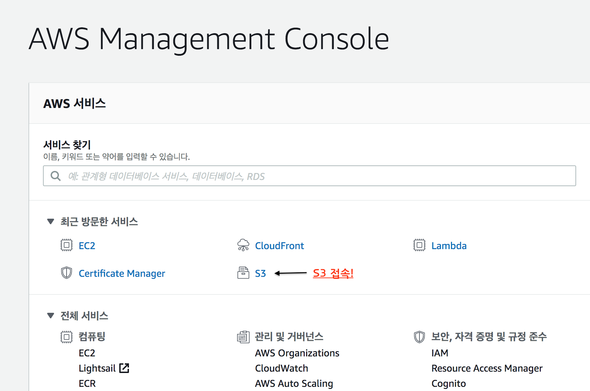

- 2. 버킷 생성
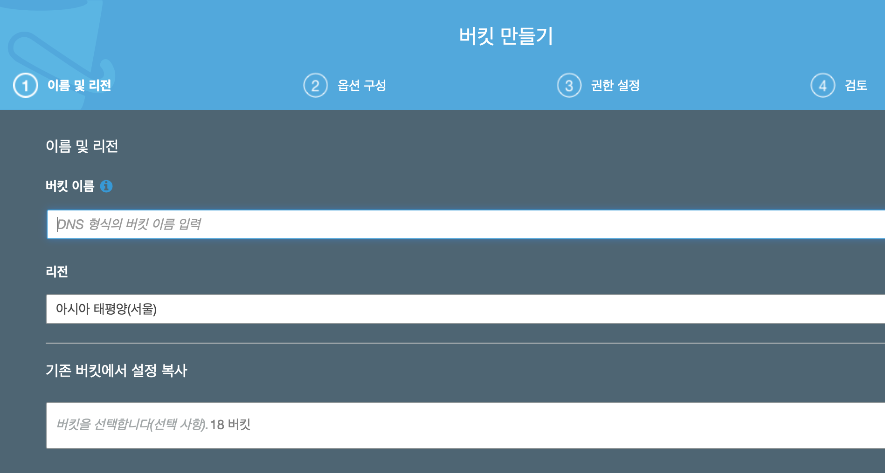

- 3. 엑세스 설정
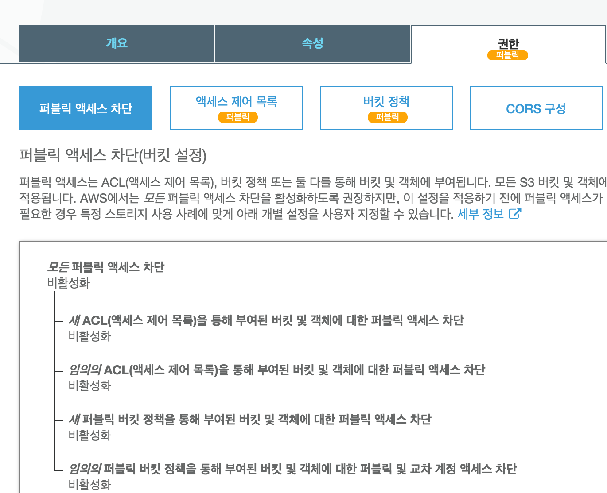

- 4. 정책 설정
```js
{
    "Version": "2012-10-17",
    "Statement": [
        {
            "Sid": "AllowPublicRead",
            "Effect": "Allow",
            "Principal": {
                "AWS": "*"
            },
            "Action": "s3:GetObject",
            "Resource": "arn:aws:s3:::버킷이름/*"
        }
    ]
}
```
## 🧐Vue Project 설정

### 1. Package.json - Settings

```js
{
 "name": "project-name",
 "version": "0.1.0",
 "private": true,
 "scripts": {
   "serve": "vue-cli-service serve",
   "build": "vue-cli-service build",
   "lint": "vue-cli-service lint",
   "deploy": "aws s3 sync ./target/dist s3://만든버킷명/"
 },
 "dependencies": {
        ....생략

 },
 "devDependencies": {
  ...생략
 },
 ... 생략
}
```
### 2. Build
```
yarn build
```
> target 폴더 Build 파일 생성

### 3. Deploy
```js
// 둘다 같은 명령어 
- 1. yarn deploy 
- 2. yarn aws aws s3 sync ./target/dist s3://만든버킷명/
```
### 4. 정적 웹사이트 호스팅 준비

- 1. S3 파일 업로드 확인
<br>
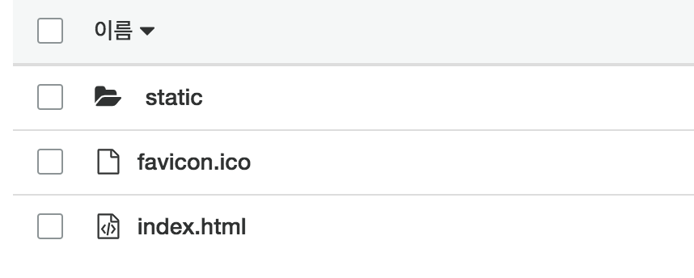

- 2. 정적 웹사이트 호스팅 설정
<br>
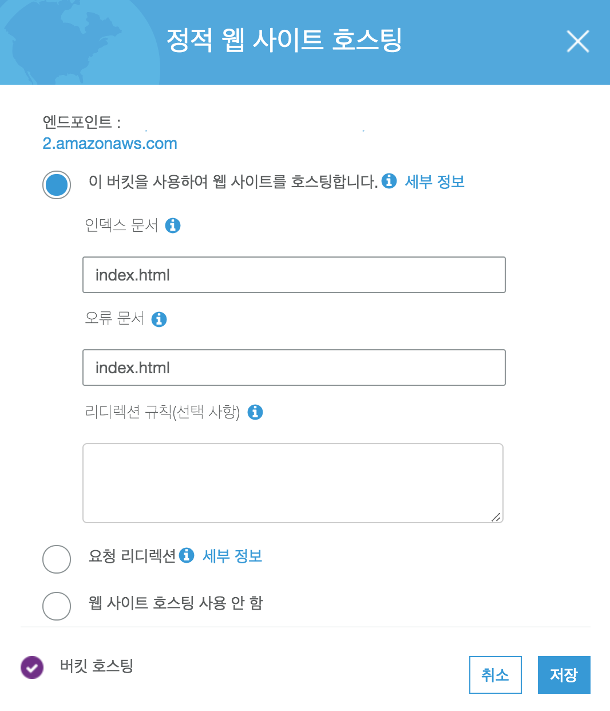


## 🧐Cloud Front & S3 연결
### 1. Cloud Front 서비스 시작 
    - Create Distribution

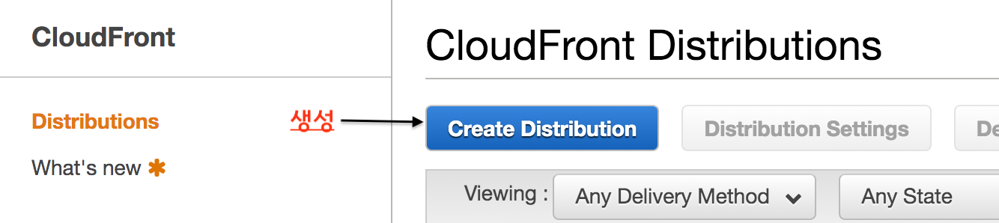

### 2. 분배 컨텐츠 방법 선택
    - WEB 
    - RTMP ( 실시간 동영상 프로토콜)
    <br>

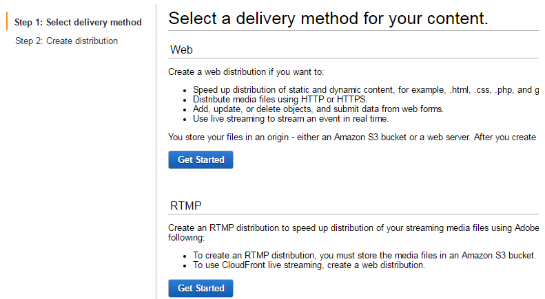

### 3. Orgin 원본 도메인 설정
```
    - 😅 버킷 명이 아니다!!!
    - s3 정적 웹사이트 엔드포인트 
```
<br>

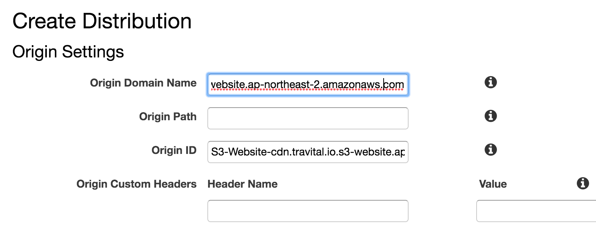

### 4. Distribution 설정 I - Cache 
값은 Default
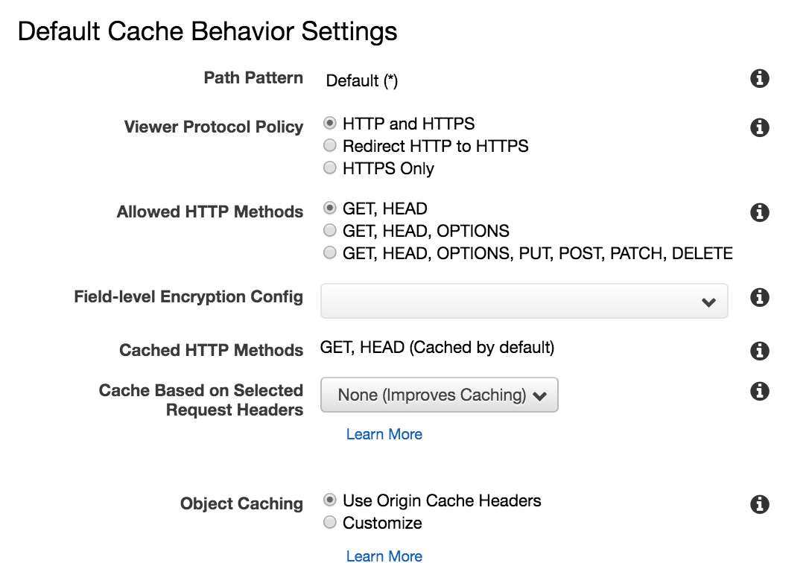

### 5. Distribution 설정 II - 분산

>지정 도메인으로 분산 설정경우 작성
없다면 Defalt


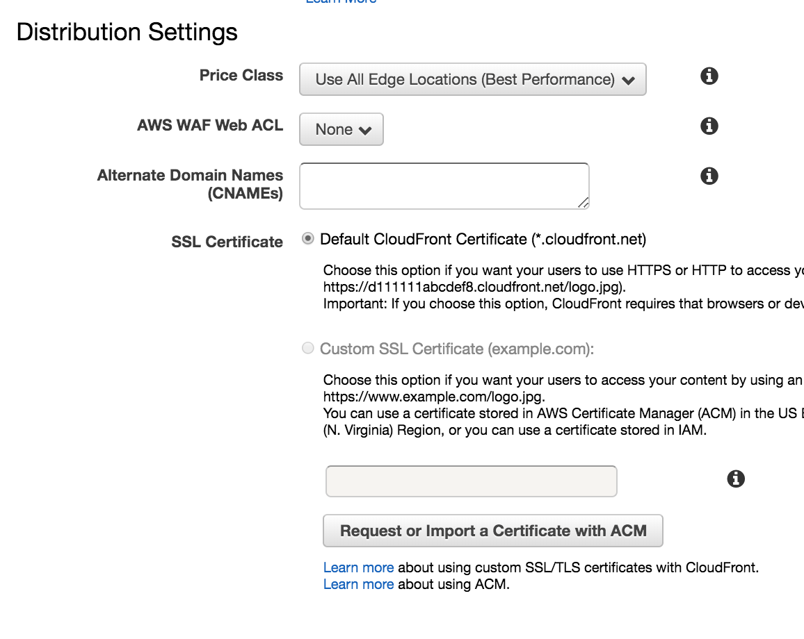

### 6. 배포 중...
생성하면 시간이 생각보다 걸린다 약 10분 이상?
`대략 15분정도 걸린다고 한다.`

## 🧐Cloud Front 연동완료
`Deployed 라고 바뀌면 배포 완료!!`😎
<br>

### 정보 & 속성 값
>[Domain Name] == 생성된 연결된 Cloud Front 도메인
접속하면 Project 배포된걸 확인 할수 있다.

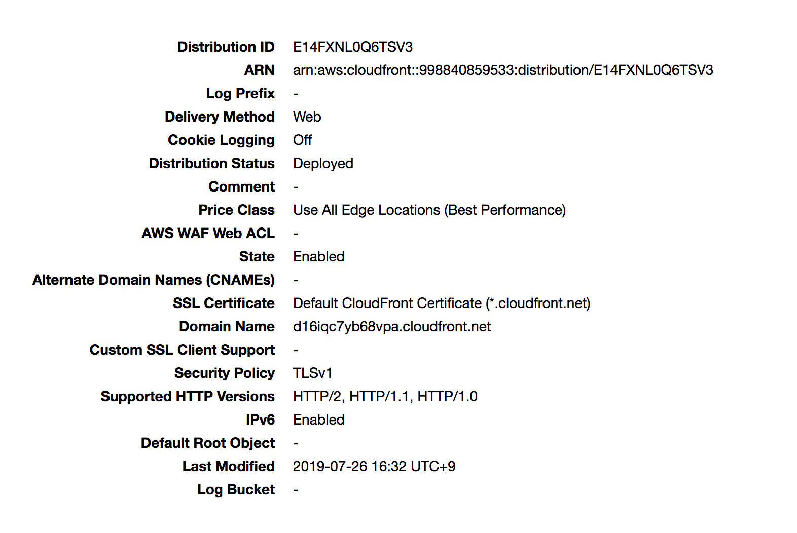

## 🧐References
<br>

> - [Aws frontcloud](https://docs.aws.amazon.com/ko_kr/AmazonCloudFront/latest/DeveloperGuide/HowCloudFrontWorks.html)
